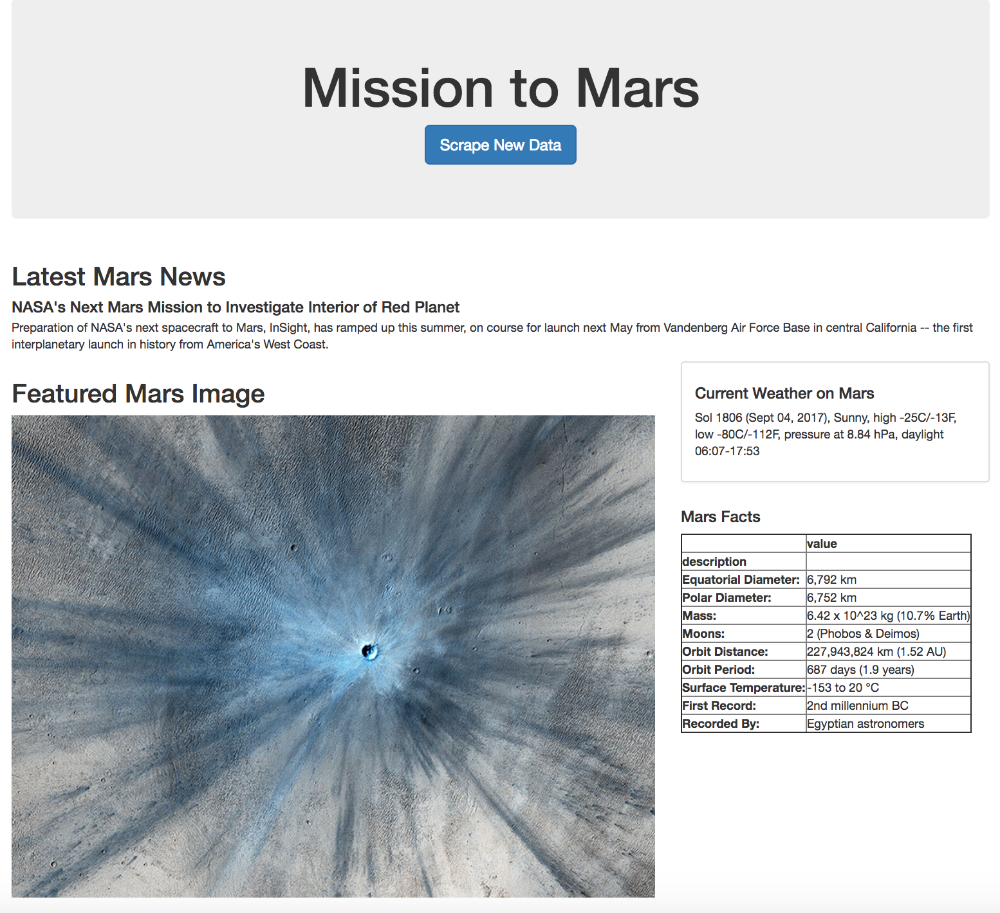
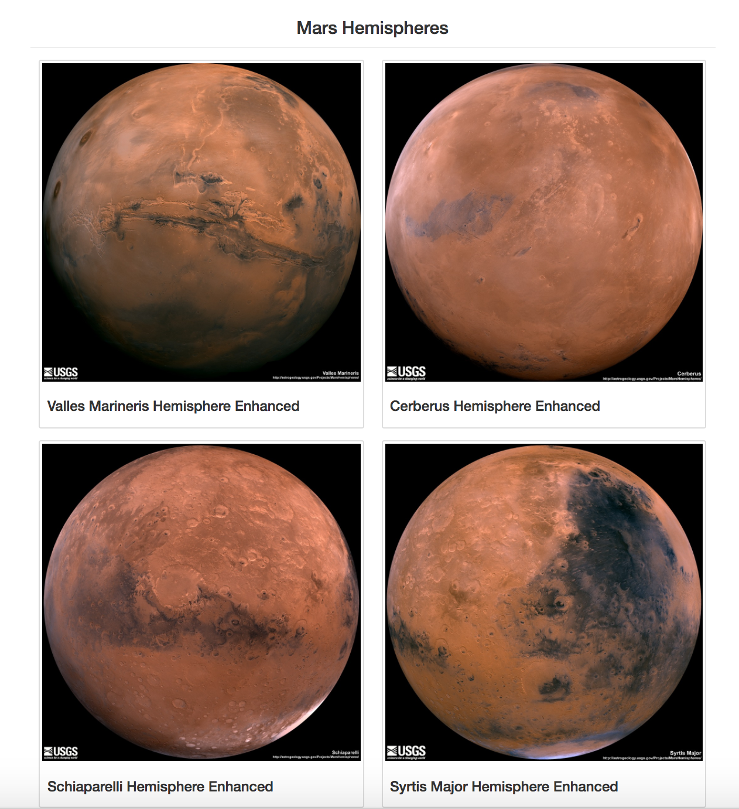

# Mission to Mars

In this assignment, the task is to build a web application that scrapes 5 different websites for data related to the Mission to Mars and displays the information in a single HTML page.

The following steps are followed in order to  achieve this objective:

## Scraping

### NASA Mars News

https://mars.nasa.gov/news/ website was used to get the latest news on Mars mission using BeautifulSoup, splinter, pandas in a jupyter notebook.

### JPL Mars Space Images - Featured Image

https://www.jpl.nasa.gov/spaceimages/?search=&category=Mars was used to scrape the featured image of mars in full resolution.

### Mars Weather

https://twitter.com/marswxreport?lang=en scrape the latest Mars weather tweet from the page. Save the tweet text for the weather report as a variable called `mars_weather`.

### Mars Facts

https://space-facts.com/mars/ to obtain the table containing facts about the planet including Diameter, Mass, etc.

### Mars Hemispheres

https://astrogeology.usgs.gov/search/results?q=hemisphere+enhanced&k1=target&v1=Mars to obtain high resolution images for each of Mar's hemispheres.

## Flask

* A python script to run all of the scraping code was designed and all of the scraped data was put into one Python dictionary.

* '/scrape' route which will import the Python script and call the scrape function was created.

## MongoDB:

* A new database and a new collection was created.

* All of the scraped data was stored in the above created database.

* Root route / that will query the database and pass the mars data into HTML template was created.

## HTML file

Finally a HTML file called 'index.html' was created that displayed all of the data in HTML elements.

